# Radio Streamer

**Radio Streamer** — десктопное приложение для воспроизведения, обработки и вещания аудиопотока в локальную сеть или интернет.

Программа может работать как обычный аудиоплеер для файлов и интернет-радиостанций, а также как полноценная станция вещания с Icecast-сервером, локальным мониторингом, кросфейдом, метаданными и гибкой настройкой аудиодвижка.

**Технологии:** Miniaudio 0.11.25 · FFmpeg 8.1.1 · Icecast 2.5.0 · Qt 6.9.0

---

## Возможности

### Плейлисты и источники

- Открытие плейлистов в форматах `m3u`, `m3u8`, `pls`, `aimppl4`, `xspf`, `csv`.
- Воспроизведение аудиофайлов: `mp3`, `flac`, `ogg`, `wav`, `aac`, `m4a`, `wma`, `opus`.
- Поддержка потоков интернет-радиостанций.
- Сохранение плейлиста в формате `m3u`.
- Редактирование, сортировка и ручное перемещение треков в плейлисте.
- Режим случайного воспроизведения с визуальной перестановкой треков: вы заранее видите, что будет играть дальше.
- Возможность сохранить текущий случайный порядок как новый порядок плейлиста.

### Аудиодвижок

- Полноценный PCM-движок на базе Miniaudio.
- Поддержка воспроизведения hi-res аудио без предварительной перекодировки плейлиста.
- Каждый источник подключается к движку как отдельный поток, что позволяет мягко переключаться между файлами и интернет-станциями.
- Настраиваемый кросфейд при смене источника.
- Разные кривые громкости для переходов.
- Локальный мониторинг: прослушивание итогового PCM-выхода на компьютере.
- Гибкие настройки аудиодвижка под разные сценарии работы.

### Декодирование и вещание

- Декодирование и кодирование аудио в реальном времени через FFmpeg.
- Вещание в форматах `mp3`, `aac`, `ogg`, `flac`.
- Встроенная работа с Icecast-сервером.
- Настройка точки вещания, формата, качества и параметров потока.
- Совместимость с большинством плееров, поддерживающих Icecast/Shoutcast-потоки.
- Возможность использовать программу как локальный плеер без вещания.

### Интернет-радио и стабильность потока

- Поддержка входных интернет-потоков.
- Работа через прокси-сервер: постоянно или только для проблемных источников.
- Защита от обрывов и лагов входных станций.
- Буферизация нестабильных источников для более мягкой подачи в общий поток.
- Статусы для треков и станций: подключение, переход, потеря сигнала, переподключение и другие состояния.

### Метаданные

- Приём и отправка метаданных.
- Гибкие шаблоны отображения и вещания.
- Настройка приоритетов, fallback-значений и заглушек.
- Корректная отдача информации даже для источников с неполными или нестабильными метаданными.
- Обновление названия трека/станции в потоке вещания.

### Локальная сеть

- mDNS-анонс потока в локальной сети.
- Возможность дать потоку удобное имя, например:

  `http://radio.local:8080/stream`

### Интерфейс

- Удобное управление воспроизведением: play, stop, next, previous.
- Настраиваемое главное окно.
- Возможность менять порядок панелей под свой рабочий сценарий.
- Две темы оформления.
- Поддержка смены языка интерфейса.
- Отображение статусов треков, станций и потока вещания.

---

### Для чего можно использовать

- как обычный плеер для файлов и интернет-радиостанций;
- как домашнюю радиостанцию в локальной сети;
- как Icecast-источник для интернет-вещания;
- как инструмент для тестирования потоков, метаданных и аудиопереходов;
- как основу для собственной автоматизированной радиостанции.

## Справка

### Содержание

1. [Начало работы](#help-start)
2. [Главное окно](#help-main-window)
3. [Оформление и расположение панелей](#help-appearance)
4. [Открытие файлов, станций и плейлистов](#help-open-playlists)
5. [Управление плейлистом](#help-manage-playlist)
6. [Случайное воспроизведение](#help-shuffle)
7. [Настройка аудиодвижка](#help-audio-engine)
8. [Настройка кросфейда](#help-crossfade)
9. [Настройка прокси для входных потоков](#help-proxy)
10. [Настройка вещания](#help-stream-config)
11. [Запуск стрима](#help-stream-start)
12. [Проверка потока в плеере](#help-stream-playback)
13. [Метаданные и статусы](#help-metadata)
14. [Если что-то не работает](#help-troubleshooting)

---

### 1. Начало работы

При первом запуске откроется мастер настройки. Он поможет быстро выбрать основные параметры приложения.

Можно пройти все шаги и настроить программу под себя, а можно просто пролистать мастер и оставить значения по умолчанию. Все параметры позже доступны в окне **Настройки**.

---

### 2. Главное окно

Главное окно Radio Streamer состоит из нескольких рабочих зон:

- верхняя панель с основными кнопками;
- таблица плейлиста;
- кнопки добавления, удаления и редактирования треков;
- транспорт управления воспроизведением;
- блок входного источника;
- блок выходного потока;
- нижний статус приложения.

В обычном режиме программу можно использовать как плеер: открыть файл, плейлист или интернет-радиостанцию и слушать через локальный мониторинг.

Если включено вещание, звук дополнительно отправляется в Icecast-поток.

---

### 3. Оформление и расположение панелей

Приложение поддерживает светлую и тёмную тему оформления. Тему можно переключить в настройках. После выбора не забудьте нажать **ОК**, чтобы применить изменения.

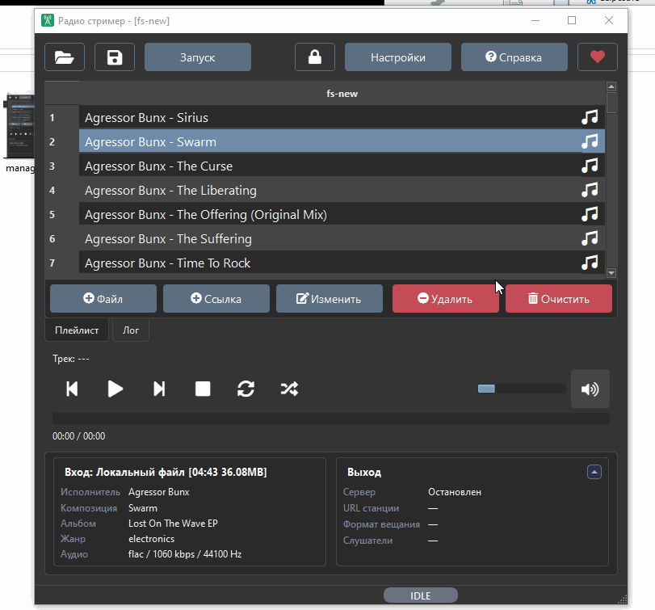

Главное окно можно настроить под себя. Нажмите на значок замка, измените порядок панелей, а затем снова закройте замок, чтобы зафиксировать расположение.

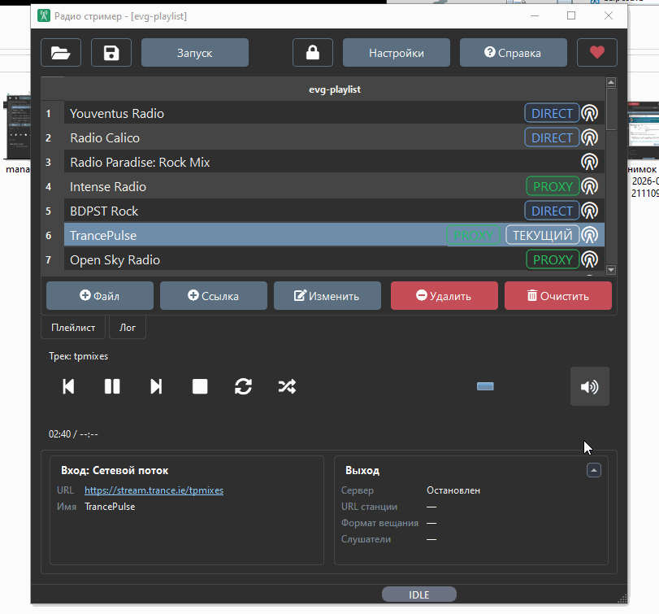

---

### 4. Открытие файлов, станций и плейлистов

Radio Streamer поддерживает плейлисты популярных форматов:

- `m3u`
- `m3u8`
- `pls`
- `aimppl4`
- `xspf`
- `csv`

В плейлисте могут быть локальные медиафайлы, ссылки на интернет-радиостанции или смешанный набор источников.

Также можно открывать отдельные аудиофайлы:

- `mp3`
- `flac`
- `ogg`
- `wav`
- `aac`
- `m4a`
- `wma`
- `opus`

После открытия плейлиста программа может сканировать файлы и читать метаданные. На больших плейлистах это занимает некоторое время, но сканирование выполняется в фоне и не мешает воспроизведению.

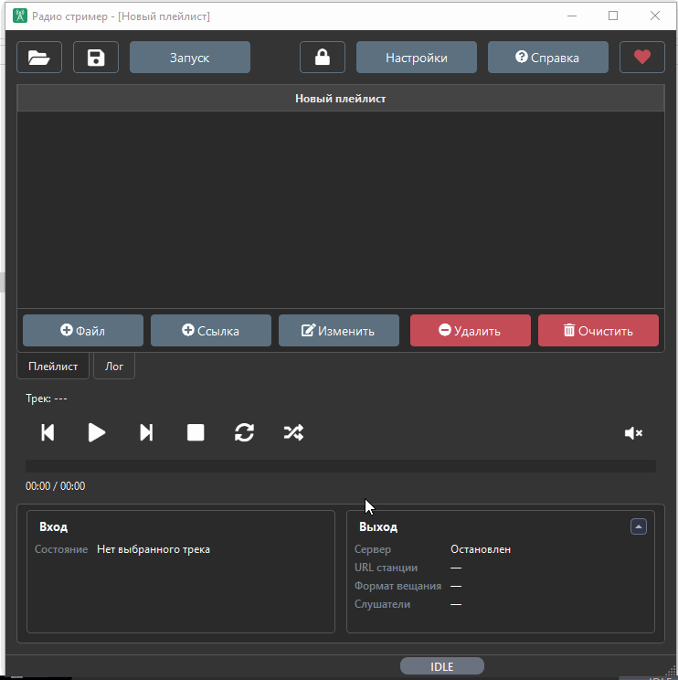

---

### 5. Управление плейлистом

В плейлист можно добавлять файлы, ссылки на станции и целые группы треков.

Доступны основные действия:

- добавить файл;
- добавить ссылку;
- изменить запись;
- удалить выбранные элементы;
- очистить плейлист;
- перетаскивать треки мышью;
- менять порядок одиночных треков и групп.

Файлы можно перетащить мышью прямо в окно программы.

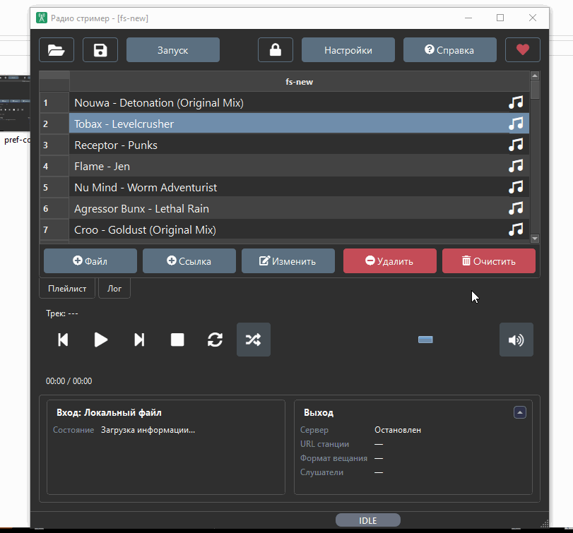

---

### 6. Случайное воспроизведение

Режим случайного воспроизведения не просто выбирает следующий трек случайно - он визуально переставляет треки в таблице. Благодаря этому заранее видно, какая композиция будет следующей.

В обычном режиме порядок таблицы соответствует настоящему порядку плейлиста.

В случайном режиме таблица показывает текущую случайную очередь. Если перетащить трек в этом режиме, изменится именно текущий случайный порядок, а не исходный порядок плейлиста.

При сохранении плейлиста в случайном режиме программа предупредит:

> Плейлист сейчас отображается в случайном порядке.  
> Сохранить плейлист в этом порядке?

Если нажать **Сохранить**, текущий видимый случайный порядок станет новым сохранённым порядком плейлиста. Если нажать **Отмена**, плейлист не будет сохранён, а случайный режим останется как был.

---

### 7. Настройка аудиодвижка

Radio Streamer использует PCM-аудиодвижок на базе Miniaudio. Он принимает разные источники, декодирует их, подготавливает общий PCM-поток, отправляет звук в локальный мониторинг и, при необходимости, в поток вещания.

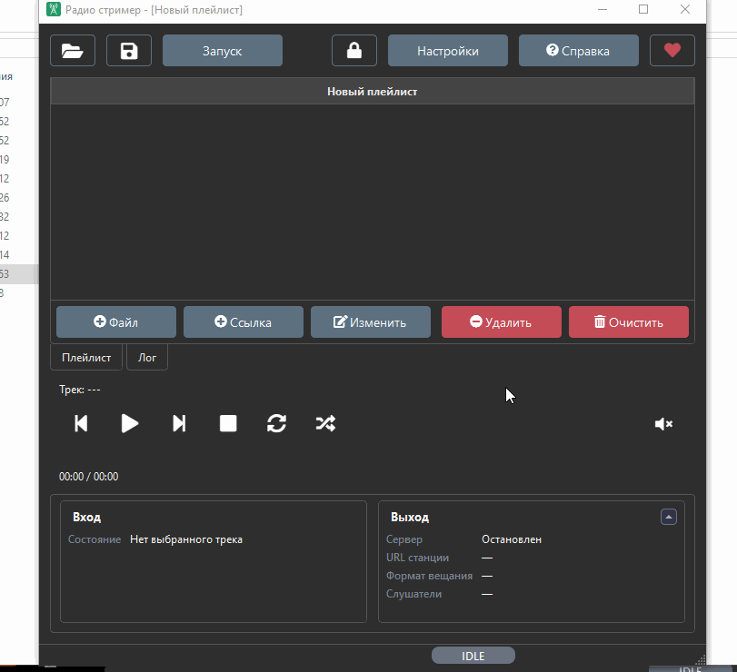

#### Простыми словами

Если вы слушаете и вещаете обычные MP3/AAC-потоки, можно выбрать более лёгкие настройки. Они требуют меньше ресурсов и подходят для большинства сценариев.

Если вы работаете с FLAC, WAV, hi-res файлами или хотите сохранить максимально высокое качество внутри аудиотракта, лучше выбрать более качественный режим. Он потребляет больше ресурсов, но уменьшает риск потерь качества при обработке.

#### Сложными словами

Внутри программы звук приводится к единому PCM-формату. Это нужно, чтобы разные источники можно было безопасно смешивать, переключать, отправлять в локальный мониторинг и кодировать в поток вещания.

Основные параметры аудиотракта влияют на то, с какой точностью программа обрабатывает звук:

- частота дискретизации;
- разрядность PCM;
- количество каналов;
- внутренний формат обработки;
- параметры декодирования и кодирования.

Если выбрать слишком лёгкий режим для lossless или hi-res источников, звук может быть приведён к более простому формату раньше, чем нужно. Например, файл высокого качества может быть декодирован, обработан и затем закодирован с меньшей точностью.

Если выбрать слишком тяжёлый режим для обычных MP3/AAC источников, программа не сделает звук “лучше”, чем он был в исходнике. Она просто будет обрабатывать его с более высокими внутренними параметрами, а затем всё равно сжимать в выбранный формат вещания. Это может быть полезно для запаса качества при обработке, но будет потреблять больше CPU и памяти.

Проще говоря:

- лёгкий режим - меньше нагрузка, достаточно для обычного вещания;
- качественный режим - больше запас по качеству, лучше для lossless/hi-res;
- максимальные настройки - не улучшают плохой исходник, но помогают не потерять качество хорошего.

Настройки аудиодвижка обычно применяются после перезапуска приложения. Также есть кнопка мгновенного применения. Она отключает текущие источники и перезапускает движок, поэтому слушатели могут быть отключены от эфира на короткое время.

---

### 8. Настройка кросфейда

Кросфейд отвечает за плавный переход между треками и станциями.

В настройках доступны разные варианты:

- обычный кросфейд - используется при автоматическом переходе в конце композиции;
- ручной кросфейд - используется при переключении через кнопки транспорта или выбор трека в плейлисте;
- длительность перехода;
- форма изменения громкости.

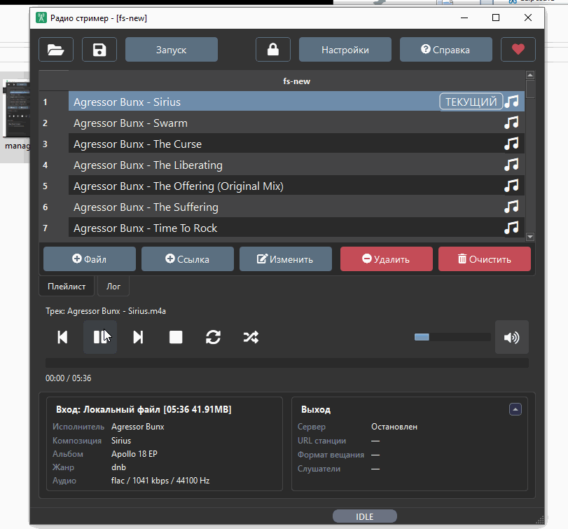

Для переходов можно выбрать разные кривые громкости. Они определяют, как быстро новый источник набирает громкость и как плавно уходит старый.

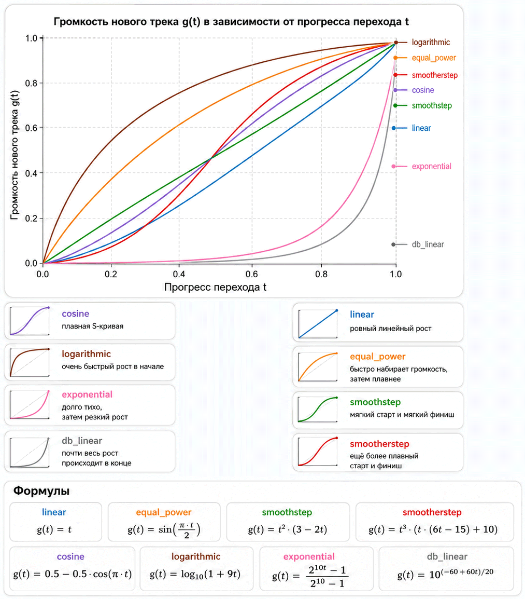

Коротко:

- `linear` - ровный линейный рост;
- `cosine` - мягкая S-кривая;
- `smoothstep` - мягкий старт и мягкий финиш;
- `smootherstep` - ещё более плавный старт и финиш;
- `equal_power` - быстро набирает громкость, затем растёт плавнее;
- `logarithmic` - быстрый рост в начале;
- `exponential` - долго тихо, затем резкий рост;
- `db_linear` - рост воспринимаемой громкости ближе к децибельной шкале.

---

### 9. Настройка прокси для входных потоков

Для интернет-радиостанций можно использовать прокси. Это полезно, если источник нестабилен, плохо отвечает напрямую или требует обходного маршрута подключения.

Прокси можно использовать:

- всегда;
- только для проблемных источников;
- отключить полностью.

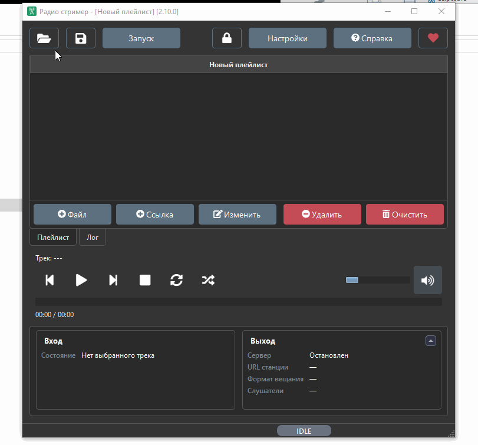

Если источник работает напрямую, программа может использовать прямое подключение. Если прямое подключение нестабильно, можно включить прокси-режим и дать приложению более устойчивый путь к потоку.

---

### 10. Настройка вещания

В разделе вещания можно выбрать:

- формат потока;
- качество;
- порт;
- точку монтирования;
- параметры Icecast-сервера.

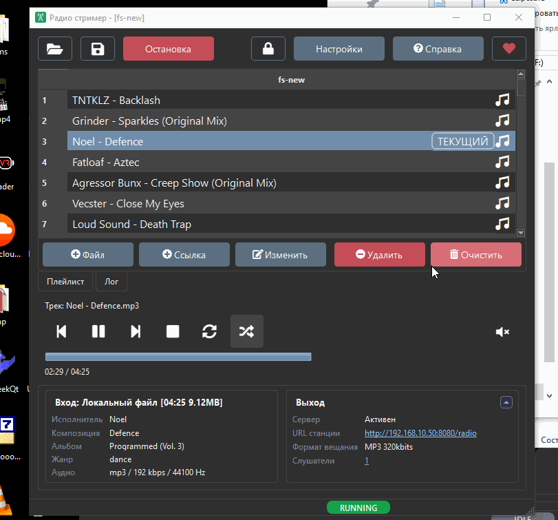

Программа поддерживает вещание в популярных форматах, включая MP3, AAC, OGG и FLAC.

Есть кнопка мгновенного применения настроек. Она перезапускает энкодер и сервер вещания в новой конфигурации. Во время такого перезапуска слушатели могут быть отключены от потока на короткое время.

---

### 11. Запуск стрима

При первом запуске вещания Windows может показать окно брандмауэра. Это нормально: Radio Streamer запускает локальный сервер вещания, и системе нужно разрешить входящие подключения.

Разрешите доступ в частных сетях, если хотите использовать поток в домашней или рабочей локальной сети.

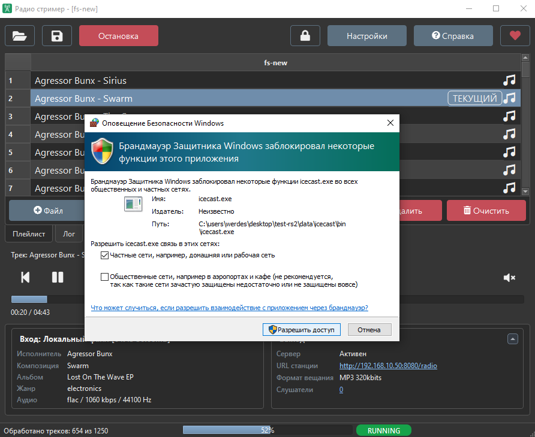

В обычной ситуации для запуска вещания достаточно нажать кнопку **Запуск**.

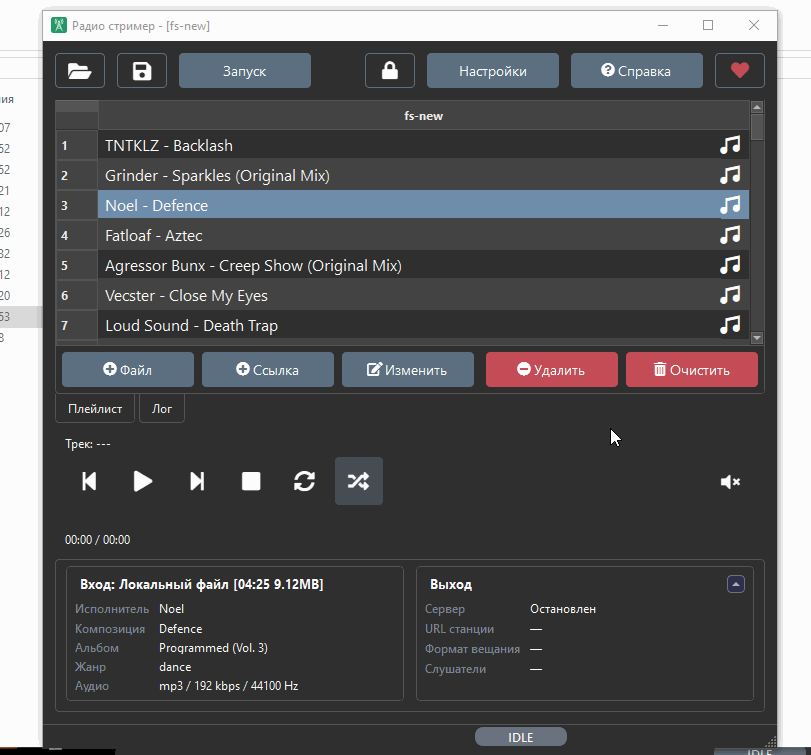

После запуска в блоке **Выход** появится статус сервера, URL станции, формат вещания и количество слушателей.

---

### 12. Проверка потока в плеере

Поток можно открыть в браузере, AIMP, VLC, интернет-радиоприёмнике или другом плеере, который поддерживает HTTP/Icecast-потоки.

Если порт проброшен наружу, ссылку можно передать другим слушателям.

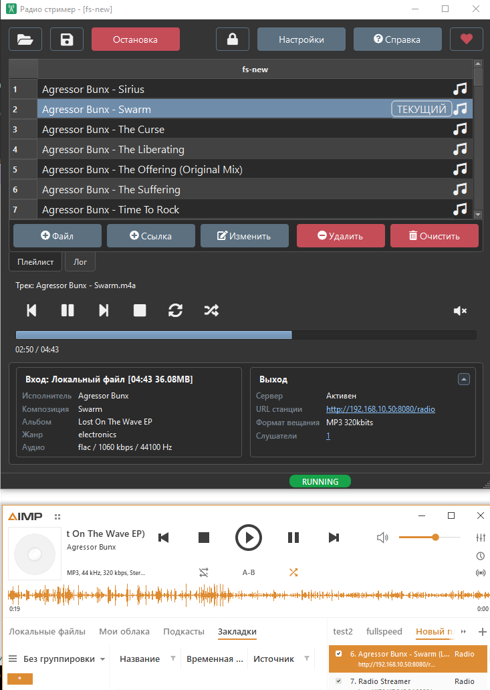

---

### 13. Метаданные и статусы

Radio Streamer умеет принимать и отправлять метаданные.

Метаданные используются для отображения:

- исполнителя;
- названия композиции;
- альбома;
- жанра;
- параметров аудио;
- названия станции;
- статуса подключения.

Для вещания можно настроить шаблоны метаданных, приоритеты и fallback-значения. Это помогает отдавать понятную информацию даже для источников, которые не передают теги или передают их нестабильно.

В таблице плейлиста и информационных блоках могут отображаться статусы:

- подключение;
- прямое подключение;
- подключение через прокси;
- потеря источника;
- переподключение;
- переход;
- текущий трек.

---

### 14. Если что-то не работает

#### Поток не открывается в другом плеере

Проверьте:

- запущен ли стрим;
- правильный ли URL указан в блоке **Выход**;
- разрешён ли доступ в брандмауэре Windows;
- не занят ли выбранный порт;
- находится ли устройство слушателя в той же сети;
- проброшен ли порт на роутере, если поток должен быть доступен из интернета.

#### Интернет-станция лагает или пропадает

Попробуйте:

- включить прокси для входных потоков;
- увеличить буфер;
- выбрать другой источник;
- проверить стабильность сети.

#### После изменения настроек звука ничего не изменилось

Некоторые параметры аудиодвижка применяются после перезапуска приложения. Для немедленного применения можно использовать кнопку мгновенного применения, но она перезапускает движок и временно отключает источники.

#### Слушатели отключились после применения настроек вещания

Это нормально, если была изменена конфигурация стрима. При мгновенном применении программа перезапускает энкодер и сервер вещания.
